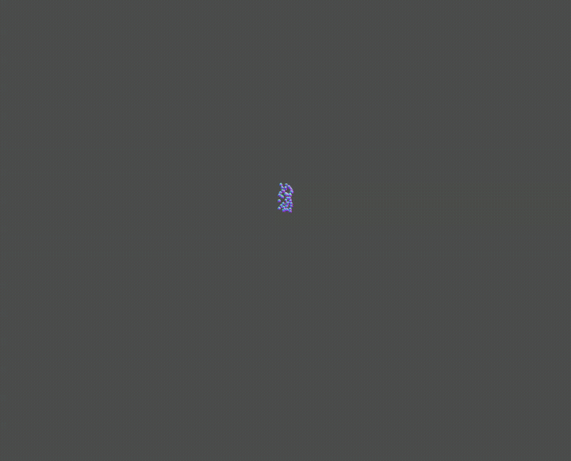
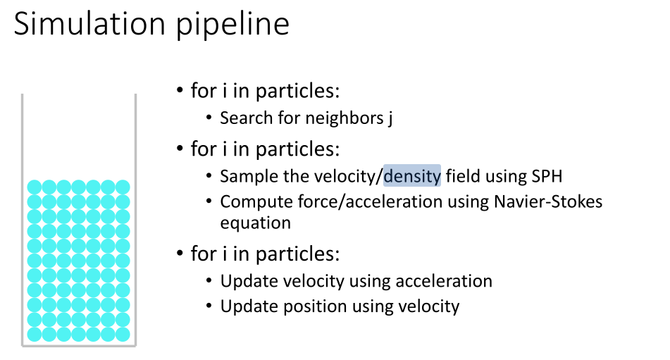
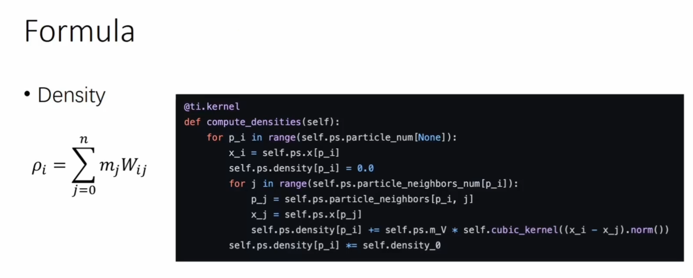
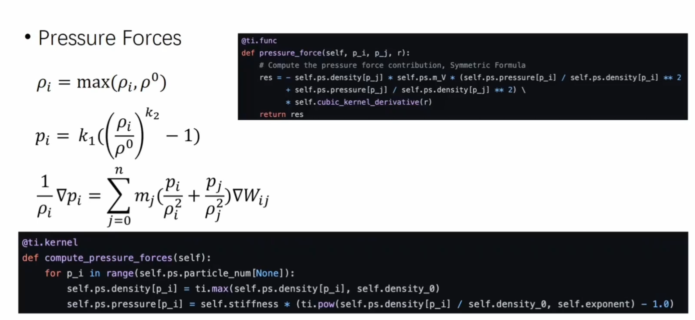
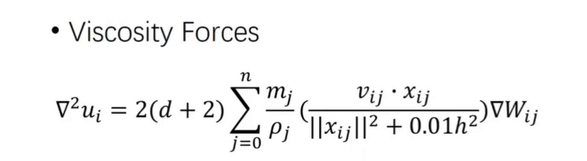

# cs488 Project

## Overview




This project, titled "Position Based Dynamics Fluid Simulator," aims to develop a comprehensive and versatile fluid simulator using . By integrating the Smoothed Particle Hydrodynamics (SPH) with the use of OpenGL for rendering, the simulator strives to achieve high fidelity in modeling fluid behavior in real-time. 

It is based on the OpenGL starter template provided by [Adrian Derstroff's OpenGL Starter](https://github.com/adrianderstroff/opengl-starter), which is released under the MIT license. The `opengl-starter` project offers a basic framework for compiling and managing various libraries required for OpenGL development.

## Controls

`C` - Clear all particles
`2` - Switch to 2D simulation
`3` - Switch to 3D simulation

## Prerequisites

Before you begin, ensure you have met the following requirements:
- **CMake**: Version 3.14 or later
- **Python**: Any recent version
- **OpenGL libraries**: GLFW3, GLAD, and GLM

For specific installation instructions, refer to the [OpenGL Starter README](https://github.com/adrianderstroff/opengl-starter).

## Compilation Instructions

### Using Visual Studio Code + Terminal

1.  **Compile the Code**:
    ```bash
    cmake . && make
    ```

2. **Run the Executable**:
   Navigate to the `bin` directory and execute the compiled binary:

   ```bash
    cd bin && ./*
    ```


## Main Project Structure

```plaintext
cs488/
├── assets/
│   └── shaders/
├── src/
│   ├── main.cpp
│   └── fbh.h
└── README.md
```

## Feature Detail

### Implementing the graphic engine using OpenGL
Firstly, since the starter code I used has only an rasterizer for one triangle, I re-write the entire `main.cpp`. The steps are rather similar to `A1`, with the only difference being in `A1`, the pixel buffer is populated by the CPU, then hand over to OpenGL vertex and fragment shader pipeline to pump out to the display; And in my current setup, the coordinates and the model of the spheres are hand over to OpenGL vertex and fragment shader pipeline, and the GPU handles the entiring rasterizing process.

I then add supports to movements using `WSAD` and camera operation with mouse, clipping and depth buffer, as well as the drawing of spheres, which conclude the basic rasterization using `OpenGL`.


### Fluid Simulation (Force Based Smooth Particle Hydrodynamic)

#### What is Smooth Particle Hydrodynamics?

Smoothed Particle Hydrodynamics (SPH) is a computational method used for simulating fluid flows. It is a mesh-free Lagrangian method where the fluid is represented by particles. Each particle carries properties such as mass, position, velocity, and density, which are smoothed using a kernel function. In this implementation, I use a Cubic Spline Kernel. The Cubic Spline Kernel is a popular choice for SPH simulations due to its smoothness and compact support. The kernel function \( W \) is defined such that it has a finite range, making computations efficient.

The Cubic Spline Kernel \( W(r, h) \) is defined as:

\[ W(r, h) = \alpha_d \begin{cases} 
1 - \frac{3}{2}q^2 + \frac{3}{4}q^3 & \text{if } 0 \leq q < 1 \\
\frac{1}{4}(2 - q)^3 & \text{if } 1 \leq q < 2 \\
0 & \text{otherwise}
\end{cases} \]

where \( q = \frac{r}{h} \) and \( \alpha_d \) is a normalization constant dependent on the dimensionality \( d \). In our case, it's 2.

The detail deriviation of the formula I am using is from [this slide](https://github.com/taichiCourse01/taichiCourse01/blob/main/material/10_fluid_lagrangian.pdf).

#### Code structure

All of my implementation related to Smooth particle hydrodynamics is inside `fbh.h`.  The structure of it can be summarized as:

```
ParticleSystem
|
├── CubicSplineKernel2D
│   ├── Value()
│   ├── Gradient()
|
├── ParticleSystem2D
│   ├── Constructor and Destructor
│   ├── SetContainerSize(
│   ├── AddFluidBlock()
│   ├── clearParticle()
│   ├── Iterate()
│       ├── ResetAcceleration()
│       ├── GridSearch()
│       ├── DensityAndPressure()
│       ├── ViscosityAcceleration()
│       ├── PressureAcceleration()
│       ├── MoveStep()
│       ├── CheckBoundary()
|
├── CubicSplineKernel3D
│   ├── Value()
│   ├── Gradient()
|
├── ParticleSystem3D
│   ├── Constructor and Destructor
│   ├── SetContainerSize(
│   ├── AddFluidBlock()
│   ├── clearParticle()
│   ├── Iterate()
│       ├── ResetAcceleration()
│       ├── GridSearch()
│       ├── DensityAndPressure()
│       ├── ViscosityAcceleration()
│       ├── PressureAcceleration()
│       ├── MoveStep()
│       ├── CheckBoundary()
```

It contains a `ParticleSystem` for simulating fluid dynamics using the Smoothed Particle Hydrodynamics (SPH) method. Key features include physical constants for fluid properties, a random number generator for particle initialization, and a `CubicSplineKernel` for calculating smoothing functions. The `ParticleSystem` class manages particle properties such as position, velocity, acceleration, density, and pressure. It supports multi-threaded neighbor search and SPH computations, including density and pressure updates, viscosity and pressure force calculations, and boundary condition applications. 

Both 2D and 3D varients are based on the same algorithm, the only difference being the cubic spline kernel is calculate differently.

#### Implementation



We will base our discussion on the 2D version, but 3D version works the same, just by considering an additional axis.

The main loop for the physic sumulation lies in `Iterate()`. 

In each loop, we firstly reset the acceleration on each particle, so our later computation can contribute to the movement of particles correctly.

Then, to enable a faster computation of the physics, I employed the strategy I used in `A3`, where I divided the area of particles into grids, and computed the neighbour particle (particles inside the same grid) info for each particles inside each grid; And dispatch as many threads as possible to at each stage of function `Iterate()`. To achieve this, the information of all particle is stored as `vector` inside `ParticleSystem` to support addition and remove of particles at runtime.

```c
std::vector<glm::vec2> particlePositions_;         // Positions of particles
std::vector<glm::vec2> particleAccelerations_;     // Accelerations of particles
std::vector<glm::vec2> particleVelocities_;        // Velocities of particles
std::vector<float> particleDensities_;             // Densities of particles
std::vector<float> particlePressures_;             // Pressures of particles
```
The information of grids and neighbours are computed at the second step, `GridSearch()`.

Then, we compute the density and pressure applied to each particle contributing from its neighbouring particles in `DensityAndPressure()` using the following formula:



And the second half of the `Pressure` formula:



```c
       for (unsigned int i = start; i < end; i++)
            {
                if (!neighbors_.empty())
                {
                    float density = 0;
                    for (const auto &neighborInfo : neighbors_[i])
                    {
                        density += kernel_.Value(neighborInfo.distance); // Sum contributions from neighboring particles
                    }
                    density *= (PARTICLE_AREA * REFERENCE_DENSITY);               // Scale density by particle area and reference density
                    particleDensities_[i] = std::max(density, REFERENCE_DENSITY); // Prevent expansion
                }

                particlePressures_[i] = STIFFNESS_CONSTANT * (std::powf(particleDensities_[i] / REFERENCE_DENSITY, PRESSURE_EXPONENT) - 1.0f);
            }
```

Then, we compute the viscosity forces in `ViscosityAcceleration()` using:




```c
     for (unsigned int i = start; i < end; i++)
            {
                if (!neighbors_.empty())
                {
                    glm::vec2 viscosityForce(0.0f, 0.0f);
                    for (const auto &neighborInfo : neighbors_[i])
                    {
                        int j = neighborInfo.particleIndex;
                        float velocityDifferenceDotRadius = glm::dot(particleVelocities_[i] - particleVelocities_[j], neighborInfo.radiusVector);                            // Dot product of velocity difference and radius
                        float denominator = neighborInfo.distanceSquared + 0.01f * SUPPORT_RADIUS_SQUARED;                                                                   // Denominator for viscosity calculation
                        viscosityForce += (PARTICLE_MASS / particleDensities_[j]) * velocityDifferenceDotRadius * kernel_.Gradient(neighborInfo.radiusVector) / denominator; // Sum viscosity forces
                    }
                    viscosityForce *= viscosityFactor;           // Scale viscosity force
                    particleAccelerations_[i] += viscosityForce; // Update acceleration with viscosity force
                }
            }
```

Then, we compute the actual force induced by the `Pressure` using the first half of the `Pressure` formula:


```c
       for (unsigned int i = start; i < end; i++)
            {
                if (!neighbors_.empty())
                {
                    glm::vec2 pressureForce(0.0f, 0.0f);
                    for (const auto &neighborInfo : neighbors_[i])
                    {
                        int j = neighborInfo.particleIndex;
                        pressureForce += particleDensities_[j] * (pressureOverDensitySquared[i] + pressureOverDensitySquared[j]) * kernel_.Gradient(neighborInfo.radiusVector); // Sum pressure forces
                    }
                    particleAccelerations_[i] -= pressureForce * PARTICLE_AREA; // Update acceleration with pressure force
                }
            }
```

(Note the order is different as we are doing all neighbours in a row)

Then, we apply acceleration we previously computed at `particleAccelerations_` to each particle inside function `MoveStep()`, and do a boundary check at `CheckBoundary()`.

For the boundary check, we used the most naive approach of manipulating velocities directly, as it's easier than the method of creating boundary particles.

The screenshot above is from [this online tutorial of SPH](https://www.bilibili.com/video/BV1mi4y1o7wz/).